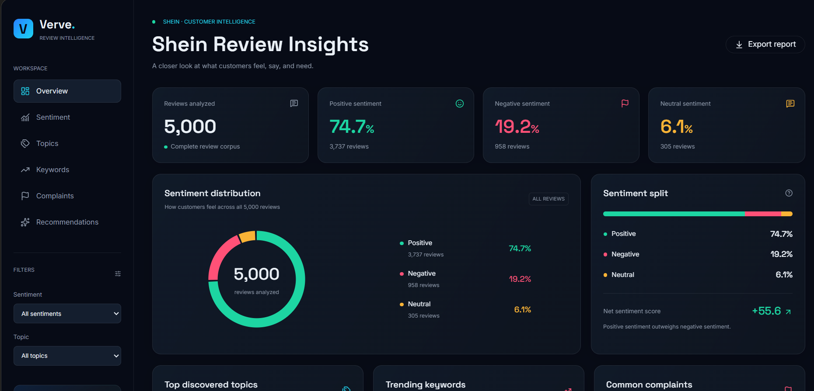
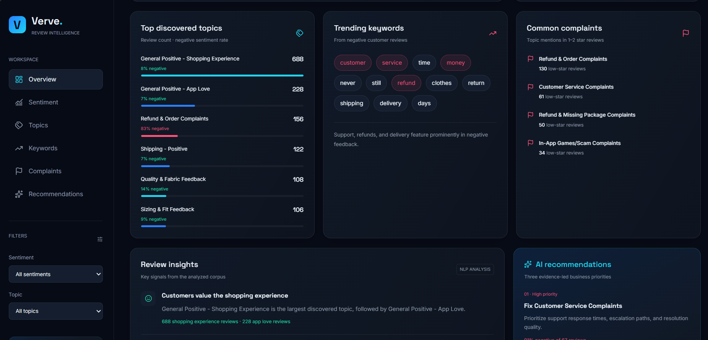
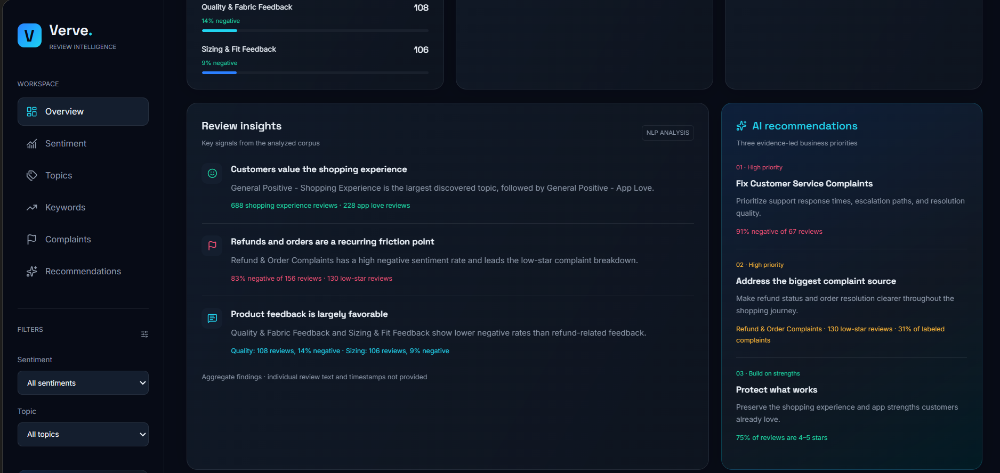

# Shein Review Insights

Sentiment and topic analysis of 5,000 Shein app reviews, with an interactive Streamlit dashboard.

**Live dashboard:** _add your link here after deploying_



## Pipeline

```
data/Shein.csv (raw reviews)
      │
      ▼
src/preprocessing.py   -> cleans text
      │
      ▼
src/sentiment.py       -> VADER sentiment + validation against star ratings
      │
      ▼
src/topic_modeling.py  -> BERTopic clustering + topic labels
      │
      ▼
data/sample_processed.csv
      │
      ▼
app.py (Streamlit dashboard)
```

## Results

Sentiment on the dashboard is based on the star rating (1-2 negative, 3 neutral, 4-5 positive).

| Sentiment | Reviews | Share |
|---|---|---|
| Positive | 3,737 | 74.7% |
| Neutral | 305 | 6.1% |
| Negative | 958 | 19.2% |

Net sentiment score: **+55.6** (positive % minus negative %).

- **Largest complaint source:** Refund & Order Complaints, 130 low-star reviews (31% of labeled complaints).
- **Highest negative rate:** Customer Service Complaints, 91% of 67 reviews are negative.
- **Frequent words in 1-2 star reviews:** customer, service, time, money, never, still, refund, clothes, return, shipping.
- **What customers like:** the shopping experience (688 reviews) and the app (228 reviews). Quality and sizing feedback is mostly favorable (14% and 9% negative).




_The screenshots show the dashboard UI designed with Stitch and built with Lovable. The interactive Streamlit version is `app.py`._

## Method

1. **Cleaning:** lowercase, remove URLs, digits, punctuation and emojis (`src/preprocessing.py`).
2. **Sentiment:** VADER on the cleaned text, then checked against star ratings. VADER agreed with the star rating on only 84.1% of reviews, and labeled 284 of 958 one- and two-star reviews as positive. The dashboard therefore uses the star rating as a ground-truth proxy (`notebooks/exploration.ipynb`, `src/sentiment.py`).
3. **Topics:** BERTopic clusters the reviews. Labels were assigned by hand from each topic's top terms.
4. **Complaints:** 1-2 star reviews grouped by topic.
5. **Recommendations:** generated by simple rules from the data (highest negative rate, largest complaint source), not by an LLM.

## Limitations

- Topic cards cover 43% of reviews. 1,764 reviews (35%) are BERTopic outliers (topic -1) and 1,079 reviews (22%) sit in 44 smaller topics that were never named.
- Some topic names describe the theme, not the sentiment. "Quality & Fabric" and "Sizing & Fit" reviews are mostly positive.
- VADER was run on cleaned text, which removes the punctuation and capitalization VADER normally uses. Running it on the raw text may improve agreement (not tested).
- The BERTopic run is not seeded, so re-running `topic_modeling.py` can change topic ids and break the label map.
- Static sample of 5,000 reviews, not a live feed.

## Project structure

```
shein-nlp-project/
├── data/                  sample_processed.csv
├── notebooks/             exploration.ipynb
├── src/                   preprocessing.py, sentiment.py, topic_modeling.py, visualization.py
├── screenshots/
├── app.py                 Streamlit dashboard
├── requirements.txt       dashboard dependencies
├── requirements-pipeline.txt   extra packages to re-run src/
└── README.md
```

## Run locally

```bash
pip install -r requirements.txt
streamlit run app.py
```

To re-run the pipeline (needs the raw `data/Shein.csv`, which is not included), install `requirements-pipeline.txt` and run the scripts in `src/` from inside the `src/` folder.

## Tech stack

Python, Pandas, VADER, BERTopic, Plotly, Streamlit
